<h1 class="title_1">AI для разработки</h1>

что бы не страдал разработчик

 

- Автолояуты (Auto layout)
- Мастер компоненты
- Организация проекта
    - Картинок (декорации)
    - Иконки
    - Стрелки
    - Имена/Шрифты/Всякое

<v-drag class='video_1' pos="610,-30,360,1000,1">
  <video controls='false' autoplay="autoplay" muted loop width="360"  src="./assets/1/prog_vs_des.mp4"></video>
</v-drag>

---

# Автолояуты (Auto layout)

Чем больше тем лучше

<video controls='false' autoplay="autoplay" muted loop width="800"  src="./assets/2/auto_layout.mp4"></video>

[Auto layout](https://help.figma.com/hc/en-us/sections/13165750874519-Use-auto-layout)

---

# Мастер компоненты

Мысли как разработчик

<v-drag pos="30,124,2000,_,0">
    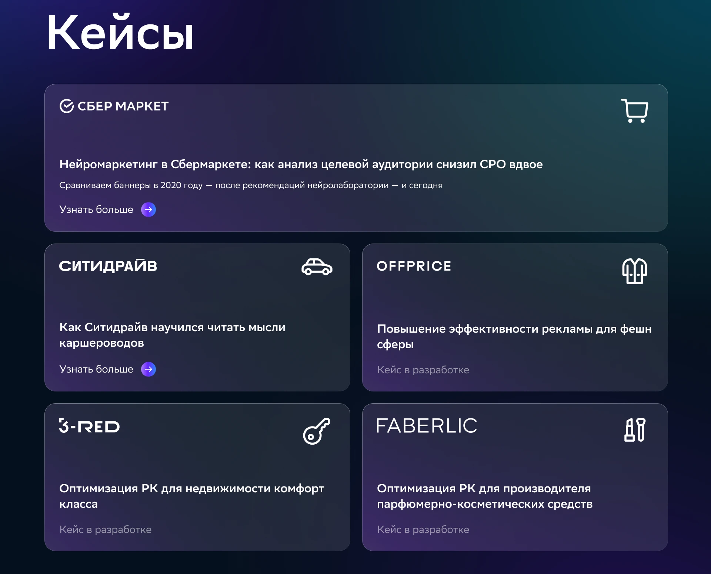
</v-drag>

<v-drag pos="30,120,2000,_,0">
    
</v-drag>

<v-drag pos="30,120,2000,_,0">
    
</v-drag>

<v-drag pos="30,120,2000,_,0">
    
</v-drag>

<v-drag pos="30,120,2000,_,0">
    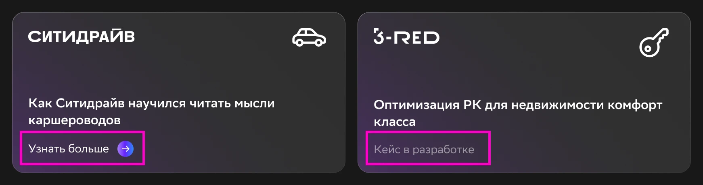
</v-drag>

<v-drag pos="30,120,2000,_,0">
    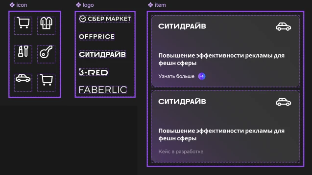
</v-drag>

<v-drag pos="30,120,2000,_,0">
    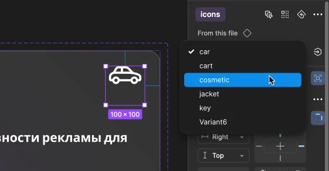
</v-drag>

<v-drag pos="30,120,2000,_,0">
  

    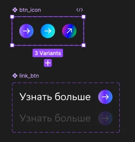
    <a v-click='7' href="https://help.figma.com/hc/en-us/articles/5579474826519-Explore-component-properties" target="_blank">Component</a>
  

</v-drag>

---

# Организация проекта

Картинок (декорации)

<v-drag pos="30,124,2000,_,0">
    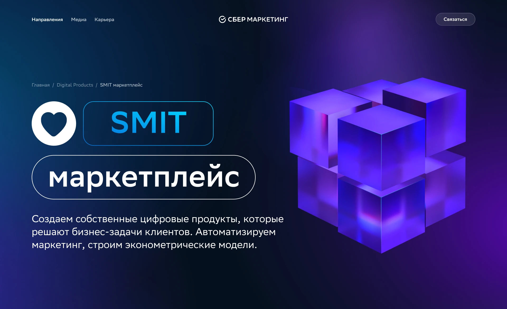
</v-drag>

<v-drag pos="30,124,2000,_,0">
    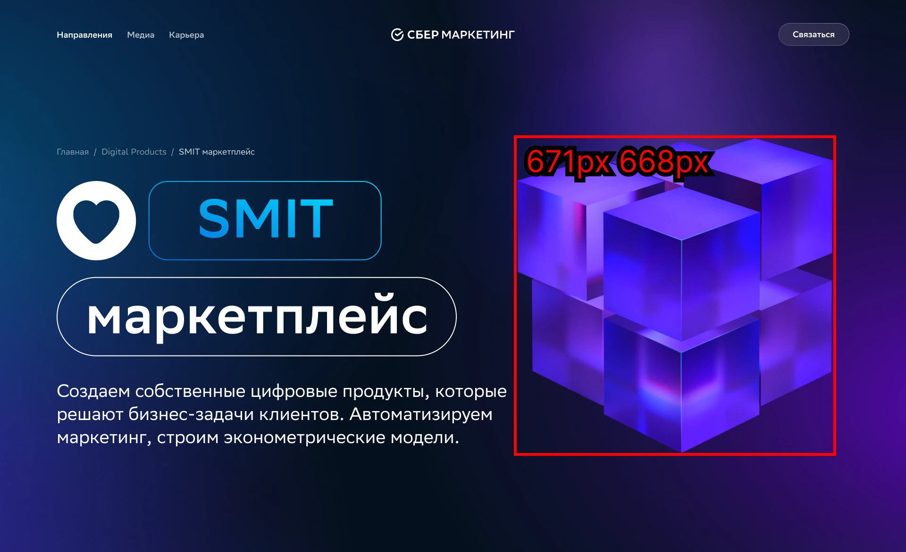
</v-drag>

<v-drag pos="30,124,2000,_,0">
    
</v-drag>

<v-drag pos="30,124,2000,_,0">
    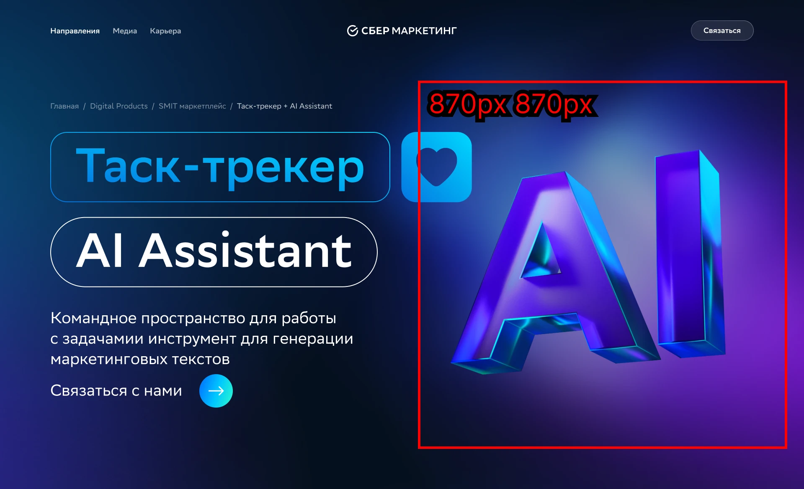
</v-drag>

<v-drag pos="30,124,2000,_,0">
    
</v-drag>

<v-drag pos="30,124,2000,_,0">
    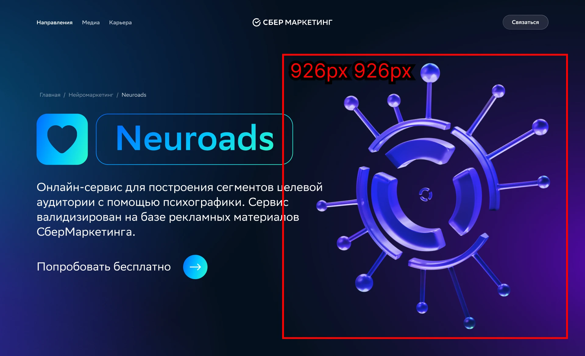
</v-drag>

<v-drag pos="20,154,2000,_,0">
    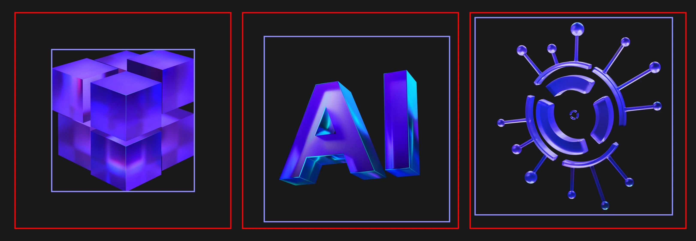
</v-drag>

<v-drag pos="30,124,2000,_,0">
    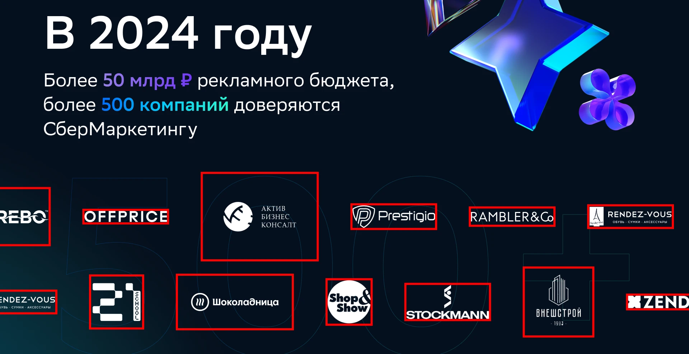
</v-drag>

---

# Организация проекта

Иконки

<v-drag pos="30,124,2000,_,0">
    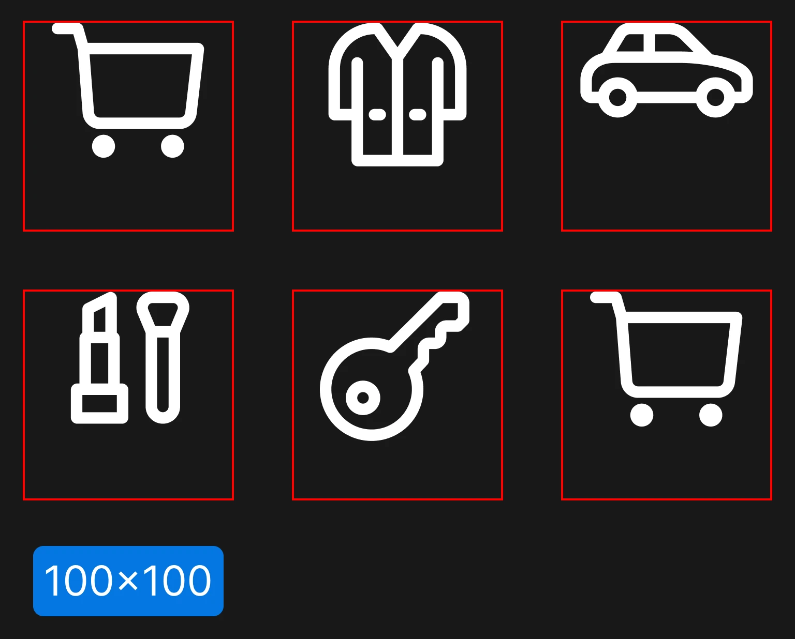
</v-drag>

<v-drag pos="30,124,2000,_,0">
    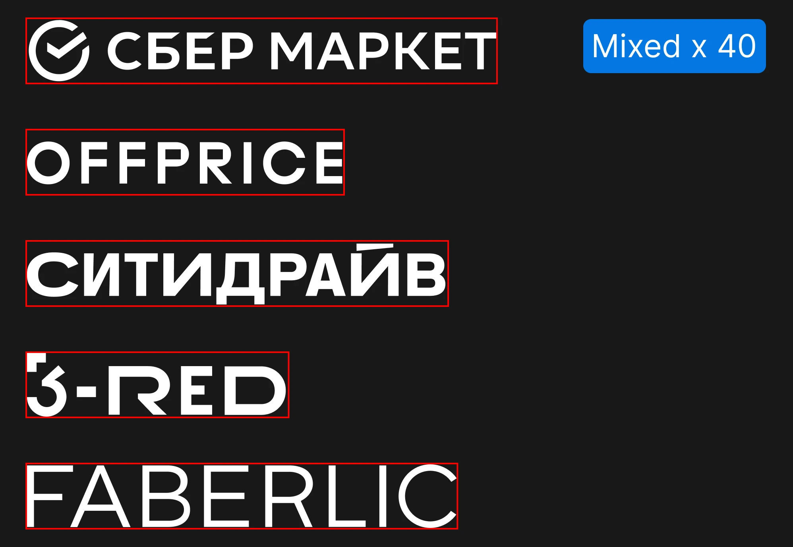
</v-drag>

---

# Стрелки

Не используйте дефолтные стрелки

<v-drag pos="30,124,2000,_,0">
    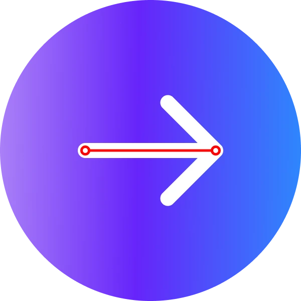
</v-drag>

<v-drag pos="500,90,2000,_,0">
    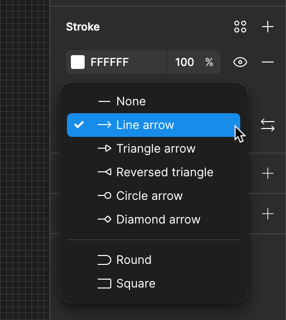
</v-drag>

<v-drag pos="30,124,2000,_,0">
    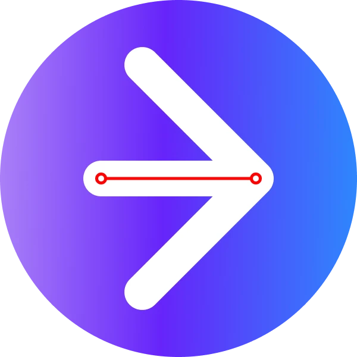
</v-drag>

<v-drag pos="30,124,2000,_,0">
    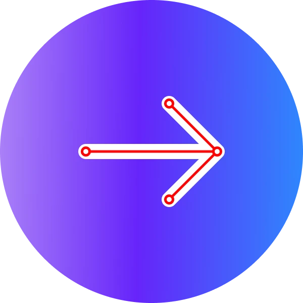
</v-drag>

<v-drag pos="30,124,2000,_,0">
    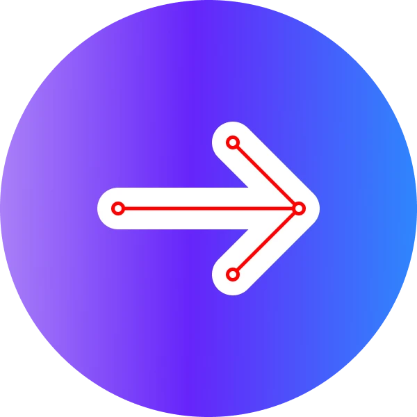
</v-drag>

---

# Имена/Шрифты/Всякое

Не обязательно но приятненько

<v-drag pos="50,124,2000,_,0">
    <video v-click='[0]' controls='false' autoplay="autoplay" muted loop width="600"  src="./assets/7/name.mp4"></video>
</v-drag>

<v-drag pos="50,124,2000,_,0">
    
     
    
</v-drag>

<v-drag pos="30,124,2000,_,0">
    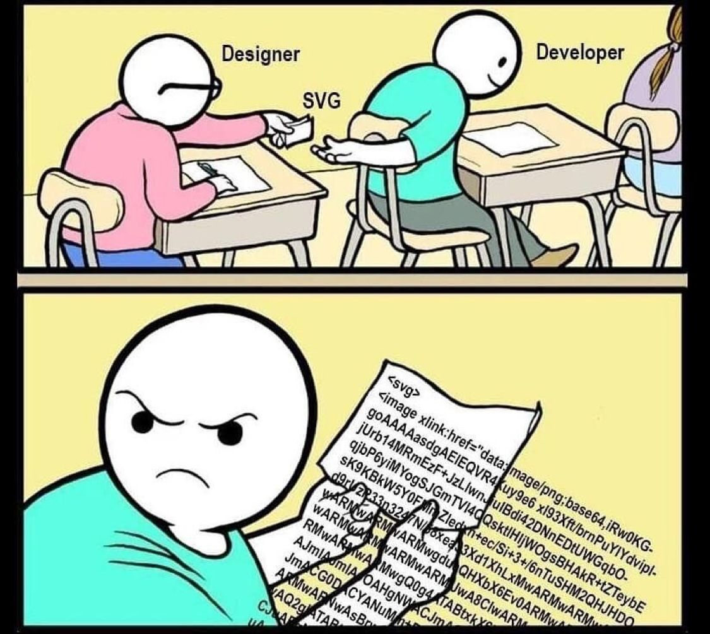
</v-drag>
