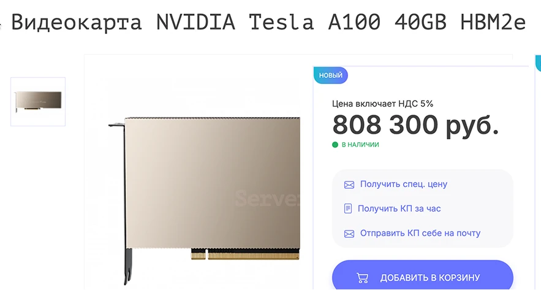
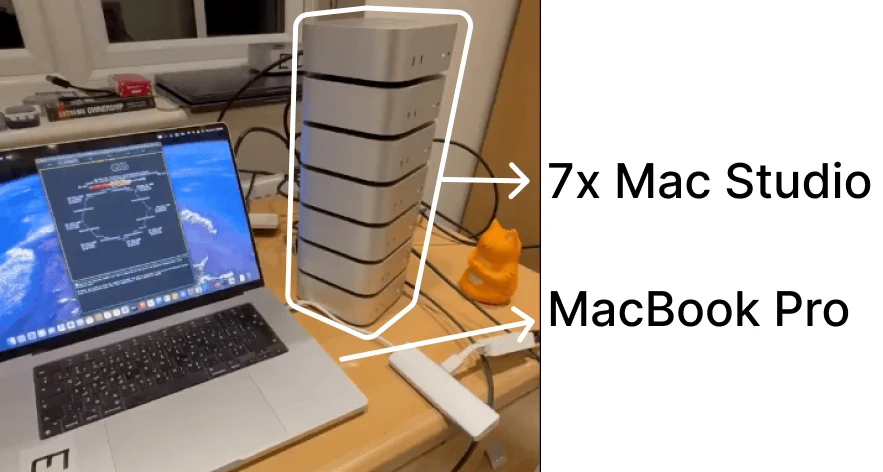

<h1 class="title_1">Увлекательная  разработка с AI</h1>

Доступные AI и что с ними делать

 
 

- Специфика использования AI
- AI в редакторе кода (GitHub Copilot, Codeium)
- Бесплатные / доступные чаты (DeepSeek, Qwen)
- Локальные AI (Ollama + Continue)
- Провайдеры AI (Bothub, GPTunneL)
- Философия использования

<v-drag class='video_1' pos="560,20,1000,1000,1">
  
</v-drag>

---

# Специфика использования AI

Чат / Автозаполнение

 
 

- Генерация кода с учётом контекста
- Модификация кода
- Объяснения как работает код
- Исправление ошибок
- Генерация документации

<v-drag pos="30,124,2000,_,0">
    <video v-click='[1]' class="w-[700px] h-auto" controls='false' autoplay="autoplay" muted loop width="2496"  src="./assets/2/chat.mp4"></video>
</v-drag>

<v-drag pos="30,124,2000,_,0">
    
</v-drag>

---

# AI в редакторе кода

Доступно нам не так много(

## [GitHub Copilot](https://github.com/features/copilot)

 

- Без VPN ничего не получится (Работает только с vpn)
- Ограничения бесплатной версии
- Проблема с покупкой $10

## [Codeium](https://codeium.com/)

 

- Чат не работает совсем
- Проблема с покупкой $15

---

# Бесплатные / доступные чаты

Китайские народные слоняры с крепким нефритовым стержнем

 
 

[DeepSeek](https://www.deepseek.com/) `DeepSeek-R1`

 

[Qwen](https://chat.qwenlm.ai/) `Qwen2.5-Plus` `Qwen2.5-Max`

<v-drag pos="560,170,2000,_,2">
    
</v-drag>

---

# Локальные AI

Самый простой способ поднять локальную AI

<v-drag pos="630,40,2000,_,0">
    
</v-drag>

[Ollama](https://ollama.com/)

| Model            | Parameters | Size   |
| ---------------- | ---------- | ------ |
| deepseek-r1:1.5b | 1.5B       | 1.1 GB |
| deepseek-r1:7b   | 7B         | 4.7 GB |
| deepseek-r1:14b  | 14B        | 9 GB   |
| deepseek-r1:32b  | 32B        | 20 GB  |
| deepseek-r1:70b  | 70B        | 43 GB  |
| deepseek-r1:671b | 671B       | 404 GB |

---

# Локальные AI

Но есть нюанс

<v-drag pos="630,40,2000,_,0">
    
</v-drag>

deepseek-r1 - 671B - 404GB

<v-drag pos="46,166,2000,_,0">
    
</v-drag>

<v-drag pos="46,166,2000,_,0">
    
</v-drag>

---

# Локальные AI

Внутри в редакторе кода

<v-drag pos="340,40,2000,_,0">
    
</v-drag>

[Continue Autocomplete](https://docs.continue.dev/customize/deep-dives/autocomplete)

| Model               | Parameters |  Size  |
| ------------------- | :--------: | :----: |
| dqwen2.5-coder:0.5b |    0.5B    | 531 MB |
| dqwen2.5-coder:1.5b |    1.5B    | 986 MB |
| dqwen2.5-coder:3b   |     3B     | 1.9 GB |
| dqwen2.5-coder:7b   |     7B     | 4.7 GB |
| dqwen2.5-coder:14b  |    14B     |  9 GB  |
| dqwen2.5-coder:32b  |    32B     | 20 GB  |

---

# Имена/Шрифты/Всякое

Не обязательно но приятненько

<v-drag pos="50,124,2000,_,0">
    <video v-click='[0]' controls='false' autoplay="autoplay" muted loop width="600"  src="./assets/7/name.mp4"></video>
</v-drag>

<v-drag pos="50,124,2000,_,0">
    
     
    
</v-drag>

<v-drag pos="30,124,2000,_,0">
    
</v-drag>
